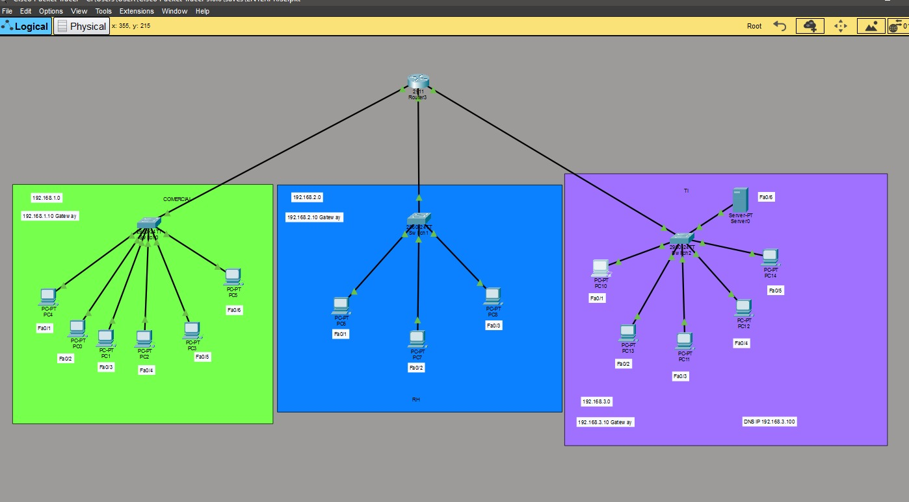
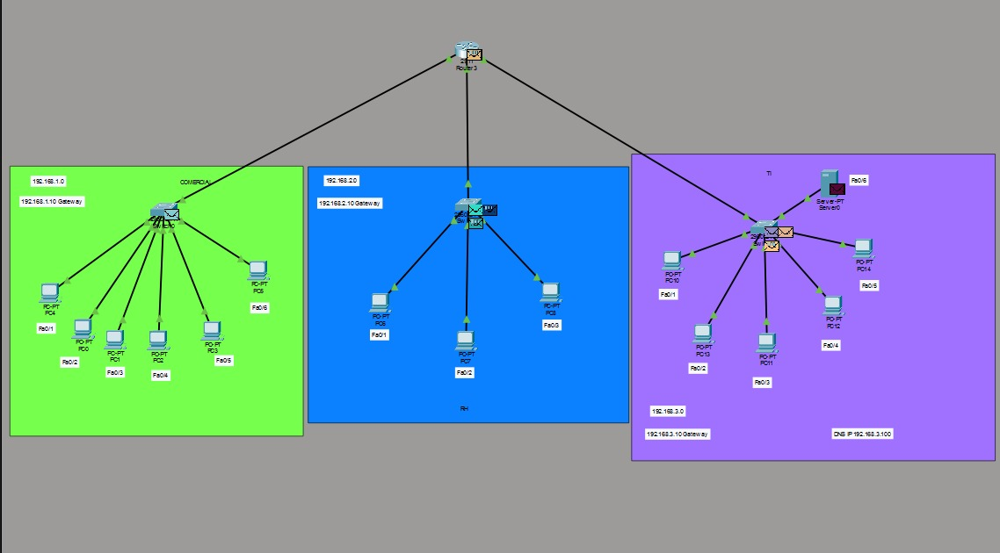
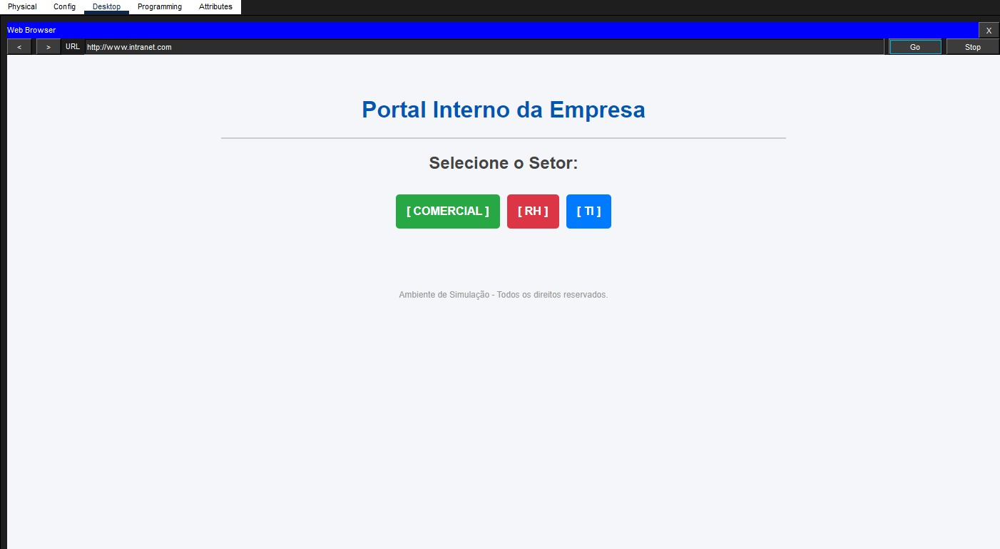
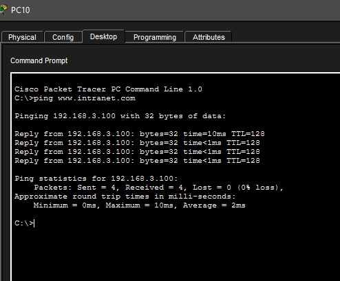
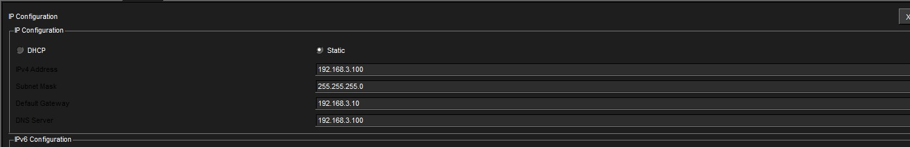

# Infraestrutura de Rede Corporativa com DHCP, DNS e Web Server

Este projeto consiste na arquitetura e implementação de uma infraestrutura de rede local (LAN) simulando o cenário real de uma empresa dividida em três setores distintos: **Comercial**, **RH** e **TI**. O laboratório foi desenvolvido utilizando o **Cisco Packet Tracer**.

##  Escopo Técnico do Projeto
* **Roteamento entre Sub-redes:** Centralização e comunicação de três sub-redes Classe C distintas através de um roteador Cisco 2911.
* **Automação com DHCP:** Pools de endereçamento IP configurados diretamente no roteador para distribuição automática nas estações de trabalho.
* **Serviços de Rede (HTTP/DNS):** Hospedagem de uma Intranet corporativa com resolução de nomes interna (`www.intranet.com`).

---

##  Planejamento de Endereçamento IP

| Setor | Sub-rede | Gateway (Roteador) | Faixa DHCP | DNS Server |
| :--- | :--- | :--- | :--- | :--- |
| **Setor 1 - Comercial** | `192.168.1.0/24` | `192.168.1.10` | `192.168.1.1` até `.254` | `192.168.3.100` |
| **Setor 2 - RH** | `192.168.2.0/24` | `192.168.2.10` | `192.168.2.1` até `.254` | `192.168.3.100` |
| **Setor 3 - TI** | `192.168.3.0/24` | `192.168.3.10` | `192.168.3.1` até `.254` | `192.168.3.100` |

>  **Nota:** Os IPs dos gateways (`.10`) foram explicitamente excluídos dos pools de DHCP para evitar conflitos de endereço na rede.

---

##  Comandos Utilizados no Roteador (Cisco CLI)

### 1. Configuração dos Pools de DHCP e DNS
```text
config terminal

ip dhcp pool COMERCIAL
 network 192.168.1.0 255.255.255.0
 default-router 192.168.1.10
 dns-server 192.168.3.100
 exit

ip dhcp pool RH
 network 192.168.2.0 255.255.255.0
 default-router 192.168.2.10
 dns-server 192.168.3.100
 exit

ip dhcp pool TI
 network 192.168.3.0 255.255.255.0
 default-router 192.168.3.10
 dns-server 192.168.3.100
 exit

### 2. Exclusão de IPs Críticos
```text
ip dhcp excluded-address 192.168.1.10
ip dhcp excluded-address 192.168.2.10
ip dhcp excluded-address 192.168.3.10
end
wr
```


##  Demonstração do Ambiente

### 1. Topologia Lógica da LAN
Estrutura de divisões físicas e lógicas dos três setores conectados ao roteador central.


### 2. Fluxo de Pacotes (Simulação em Massa)
Teste de carga utilizando PDUs para validar o tráfego ICMP e HTTP entre as sub-redes sem perdas ou gargalos.


### 3. Acesso à Intranet Corporativa
Validação ponta a ponta do serviço HTTP exibindo o portal interno customizado em HTML através do navegador de uma estação de trabalho.


### 4. Teste de Resolução de Nomes (DNS via CMD)
Prompt de Comando demonstrando o sucesso do DNS em traduzir a URL `www.intranet.com` diretamente para o IP estático do servidor (`192.168.3.100`).



### 5. Configurações de Rede do Servidor
Configuração de IP estático, Gateway padrão e loopback de DNS para gerenciar as requisições de domínio internas.


---

## 🚀 Como testar este laboratório
1. Faça o download do arquivo `.pkt` presente neste repositório.
2. Abra o arquivo no **Cisco Packet Tracer**.
3. Entre em qualquer terminal das sub-redes, abra o navegador web e digite `www.intranet.com` para testar a conectividade.

